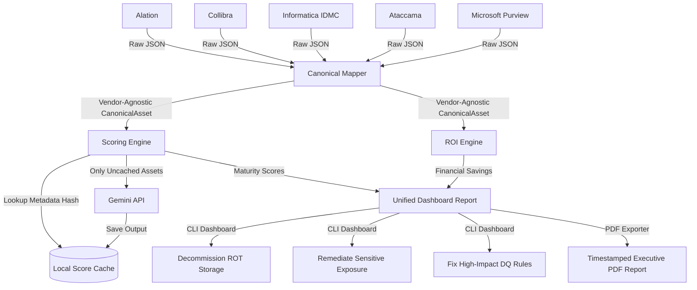

# AI Governance ROI Optimization Accelerator

## Executive Summary
Organizations spend millions of dollars deploying Data Governance platforms like **Alation, Collibra, Informatica IDMC, Ataccama, and Microsoft Purview**. However, demonstrating the concrete business return on investment (ROI) for these programs remains a persistent challenge. 

The **AI Governance ROI Optimization Accelerator** is a vendor-agnostic framework designed to ingest, map, score, and monetize data governance assets. By translating technical metadata (such as documentation depth, ownership coverage, data quality pass rates, and query logs) into financial KPIs, this accelerator helps data offices:
1. **Quantify Realized ROI**: Calculate productivity hours saved and data breach risks mitigated by existing governance efforts.
2. **Identify Idle/Waste Costs**: Pinpoint Redundant, Obsolete, and Trivial (ROT) datasets for decommissioning to achieve immediate cloud storage cost savings.
3. **Prevent Financial & Regulatory Risk**: Pinpoint high-usage, sensitive datasets that are un-owned or have poor data quality, preventing expensive operational errors and compliance failures.
4. **Compile Executive Reports**: Generate audit-ready, timestamped PDF reports showing exact maturity breakdowns and ROI calculations with embedded mathematical formulas.

---

## Architecture & Data Flow



1. **Ingest / Raw Data**: Vendor-specific raw JSON payloads reflecting different environments (databases, schemas, reports, files) generated programmatically.
2. **Canonical Mapping**: Conversion of raw data into a unified schema represented by `CanonicalAsset` models in [canonical_metadata_model.py](canonical_metadata_model.py).
3. **Analytical Engines**:
   - **Scoring Engine** evaluates documentation quality, data quality, lineage coverage, and data security risks.
   - **ROI Engine** translates these scores, coupled with storage sizes and query logs, into dollar-value metrics.
4. **Insights**: Platform summaries, enterprise net ROI metrics, targeted remediation recommendations, and PDF generation.

---

## File Layout

- [canonical_metadata_model.py](canonical_metadata_model.py): Defines the unified Pydantic data structures (`CanonicalAsset`, `AssetOwner`, `DataQualitySummary`, etc.) and vendor-specific mappers for parsing raw inputs.
- [governance_scoring_engine.py](governance_scoring_engine.py): Implements governance maturity equations (Documentation, DQ, Lineage, and Policy Risk) and calculates the composite Governance Health Index (GHI).
- [roi_calculation_engine.py](roi_calculation_engine.py): Computes financial values for operational efficiency (discovery time saved), storage optimization (decommissioning ROT), data quality improvement, and breach risk reduction.
- [executive_pdf_report.py](executive_pdf_report.py): Core utility that maps, scores, and calculates ROI metrics for a catalog platform, outputting a typeset, audit-ready PDF summary.
- [reports/](reports/): Directory where generated PDF assessments are parked with dynamic, timestamped filenames.
- [RealisticGovernanceMetadata.py](RealisticGovernanceMetadata.py): Scaled multi-vendor generator and CLI performance demo runner.
- [generate_all_mock_data.py](generate_all_mock_data.py): Batch utility to programmatically scale and output mock catalog JSONs to vendor subdirectories.
- [requirements.txt](requirements.txt): Environment dependencies (including `reportlab` for PDF generation).
- `.governance_score_cache.json`: Local cache storing metadata hashes and calculated scoring outputs to bypass redundant Gemini API calls.
- `.rate_limit_cache.json`: Local rate limit cache to track client requests and prevent API exhaustion.

---

## Mathematical Models & Research Grounding

### 1. Governance Maturity Scores
* **Documentation Completeness Score (0-100)**:
  $$\text{Documentation Score} = \text{Has Description}(40) + \text{Description } > 50 \text{ chars}(10) + \text{Has Owner}(30) + \text{Has Glossary Terms}(20)$$
* **Data Quality Score (0-100)**:
  $$\text{Data Quality Score} = \text{DQ Pass Rate} \times 100 \quad (\text{0 if no rules run - unmonitored})$$
* **Lineage Transparency Score (0-100)**:
  $$\text{Lineage Score} = \text{Has Upstream}(50) + \text{Has Downstream}(50)$$
* **Security & Policy Risk Score (0-100)**:
  Evaluates exposure of sensitive data (PII/Confidential words or tags). Sensitive assets receive a base risk of 20, adding +40 for missing owners, +20 for missing tags, and +20 for unmonitored data quality.
* **Governance Health Index (GHI)**:
  $$\text{GHI} = (\text{Doc} \times 0.3) + (\text{DQ} \times 0.4) + (\text{Lineage} \times 0.2) + ((100 - \text{Risk}) \times 0.1)$$
  *Grounded in the DAMA DMBOK Framework principles for administrative and technical metadata controls.*

### 2. Financial ROI Calculations
* **Data Discovery Efficiency Savings (USD)**:
  $$\text{Discovery Savings} = (\text{Annual Queries} \times 10\% \text{ search ratio}) \times 3.5 \text{ hrs saved} \times \$75/\text{hr rate} \times \frac{\text{Doc Score}}{100}$$
  *Grounded in Forrester's Total Economic Impact (TEI) studies on data catalog search productivity.*
* **Redundant, Obsolete, and Trivial (ROT) Storage Savings (USD)**:
  Identifies datasets with 0 usage, inactive for $> 6$ months, and with storage footprint $> 0$.
  $$\text{Storage Savings (Opportunity)} = \text{Asset Size (GB)} \times \$0.24/\text{GB}/\text{Year}$$
  *Grounded in standard AWS, Azure, and GCP blended object storage costs ($0.02/GB/month).*
* **Data Quality Incident Avoidance Savings (USD)**:
  $$\text{DQ Savings} = (\text{Baseline Incidents [4.0]} - \text{Current Incidents}) \times \$15,000/\text{Incident}$$
  *Grounded in Gartner's Data Quality Market Impact Surveys and developer pipeline debug cost models.*
* **Compliance & Breach Risk Savings (USD)**:
  $$\text{Risk Mitigation Savings} = (5\% \text{ baseline probability} - \text{Current probability}) \times \$150,000 \text{ breach cost}$$
  *Grounded in IBM Security's annual Cost of a Data Breach Report ($160/compromised PII record).*

---

## Caching & Performance Optimization

To minimize LLM token usage and ensure fast, predictable runs, a local client-side cache is built into the Scoring Engine:
- **Metadata Hashing**: Computes unique hashes for each asset based on metadata values (description, owners, glossary, data quality pass rate).
- **Selective LLM Analysis**: Only assets with new or modified metadata are analyzed via LLM APIs. 
- **Instant Execution**: Cached assets skip the LLM inference stage entirely, allowing daily report generation to complete in seconds with zero token overhead for unmodified datasets.

---

## Multi-LLM Auto-Routing

The scoring engine supports multi-LLM vendor configurations out-of-the-box using LiteLLM. It automatically detects and routes to the appropriate provider and model based on the active API key loaded in environment variables:

- **Gemini**: Set `GEMINI_API_KEY` (defaults to `gemini/gemini-2.5-flash`).
- **Claude**: Set `ANTHROPIC_API_KEY` (defaults to `anthropic/claude-3-5-sonnet-20241022`).
- **OpenAI GPT**: Set `OPENAI_API_KEY` (defaults to `openai/gpt-4o`).

Clients can override the default models by setting the `LLM_MODEL` environment variable (e.g., `LLM_MODEL="openai/gpt-4-turbo"`).

---

## Quick Start Guide

### Prerequisites
* Python 3.8 or higher installed.

### Setup & Installation
1. Clone the repository and navigate to the project directory.
2. Install the required dependencies:
   ```bash
   pip install -r requirements.txt
   ```

### 1. Ingestion & Scale Simulation
Generate and run an interactive enterprise simulation (which outputs `sample_governance_metadata.json` in the root folder):
```bash
python RealisticGovernanceMetadata.py
```
> [!TIP]
> To simulate a larger enterprise environment, you can scale the number of assets generated per vendor using the `--num-assets` argument. For example, to generate 100 assets per catalog platform:
> ```bash
> python RealisticGovernanceMetadata.py --num-assets 100
> ```

You can also batch-generate scaled individual catalog files inside vendor subdirectories (e.g. `alation/sample_alation_metadata.json`):
```bash
python generate_all_mock_data.py --num-assets 100
```

### 2. Compiling Executive PDF Reports
To compile a typeset PDF report with embedded formulas and prioritized remediation tasks for a specific platform implementation (e.g., Alation):
```bash
python executive_pdf_report.py --platform alation --input alation/sample_alation_metadata.json
```
* The output report is timestamped and automatically parked in the **[reports/](reports/)** directory (e.g., `reports/alation_executive_report_20260604_212501.pdf`).
