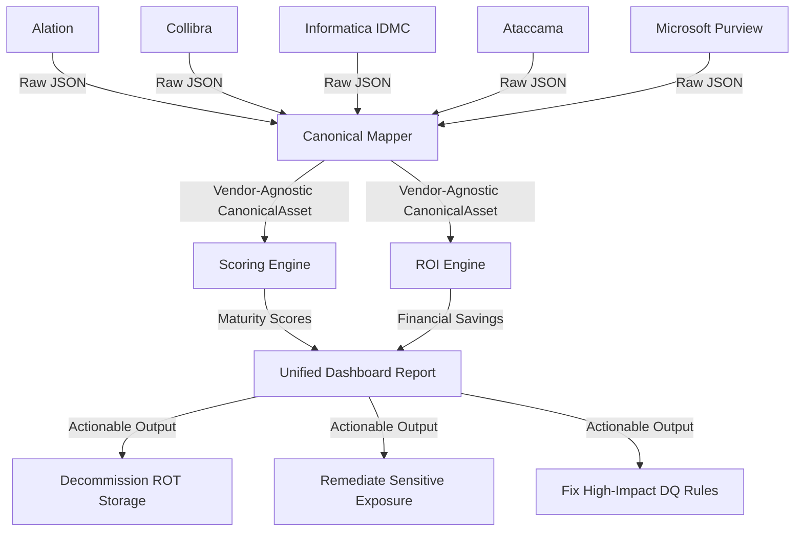

# AI Governance ROI Optimization Accelerator

## Executive Summary
Organizations spend millions of dollars deploying Data Governance platforms like **Alation, Collibra, Informatica IDMC, Ataccama, and Microsoft Purview**. However, demonstrating the concrete business return on investment (ROI) for these programs remains a persistent challenge. 

The **AI Governance ROI Optimization Accelerator** is a vendor-agnostic framework designed to ingest, map, score, and monetize data governance assets. By translating technical metadata (such as documentation, ownership, data quality pass rates, and usage volume) into financial KPIs, this accelerator helps data offices:
1. **Quantify Realized ROI**: Calculate productivity hours saved and data breach risks mitigated by existing governance efforts.
2. **Identify Idle/Waste Costs**: Pinpoint Redundant, Obsolete, and Trivial (ROT) datasets for decommissioning to achieve immediate cloud storage cost savings.
3. **Prevent Financial & Regulatory Risk**: Pinpoint high-usage, sensitive datasets that are un-owned or have poor data quality, preventing expensive operational errors and compliance failures.

---

## Architecture & Data Flow



1. **Ingest / Raw Data**: Vendor-specific raw JSON payloads reflecting different environments (databases, schemas, reports, files).
2. **Canonical Mapping**: Conversion of raw data into a unified schema represented by `CanonicalAsset` models in [canonical_metadata_model.py](file:///C:/Users/YashBhagde/Documents/GitHub/AIDGROIACC/canonical_metadata_model.py).
3. **Analytical Engines**:
   - **Scoring Engine** evaluates documentation quality, data quality, lineage coverage, and data security risks.
   - **ROI Engine** translates these scores, coupled with storage sizes and query logs, into dollar-value metrics.
4. **Insights**: Platform summaries, enterprise net ROI metrics, and targeted remediation recommendations.

---

## File Layout

- [canonical_metadata_model.py](file:///C:/Users/YashBhagde/Documents/GitHub/AIDGROIACC/canonical_metadata_model.py): Defines the unified Pydantic data structures (`CanonicalAsset`, `AssetOwner`, `DataQualitySummary`, etc.) and vendor-specific mappers for parsing raw inputs.
- [governance_scoring_engine.py](file:///C:/Users/YashBhagde/Documents/GitHub/AIDGROIACC/governance_scoring_engine.py): Implements governance maturity equations (Documentation, DQ, Lineage, and Policy Risk) and calculates the composite Governance Health Index (GHI).
- [roi_calculation_engine.py](file:///C:/Users/YashBhagde/Documents/GitHub/AIDGROIACC/roi_calculation_engine.py): Computes financial values for operational efficiency (time saved in discovery), storage optimization (decommissioning ROT), data quality improvement (incident avoidance), and risk reduction.
- [RealisticGovernanceMetadata.py](file:///C:/Users/YashBhagde/Documents/GitHub/AIDGROIACC/RealisticGovernanceMetadata.py): A utility to programmatically generate realistic multi-vendor metadata, map them to the canonical model, and execute the scoring and ROI calculations for testing.
- [sample_governance_metadata.json](file:///C:/Users/YashBhagde/Documents/GitHub/AIDGROIACC/sample_governance_metadata.json): Simulated metadata representing the output of the five supported catalogs across typical business scenarios.
- [requirements.txt](file:///C:/Users/YashBhagde/Documents/GitHub/AIDGROIACC/requirements.txt): Environment dependencies.

---

## Mathematical Models

### 1. Governance Maturity Scores
- **Documentation Completeness Score (0-100)**:
  $$\text{Documentation Score} = \text{Has Description}(40) + \text{Description } > 50 \text{ chars}(10) + \text{Has Owner}(30) + \text{Has Glossary Terms}(20)$$
- **Data Quality Score (0-100)**:
  $$\text{Data Quality Score} = \text{DQ Pass Rate} \times 100 \quad (\text{0 if no rules run - unmonitored})$$
- **Lineage Transparency Score (0-100)**:
  $$\text{Lineage Score} = \text{Has Upstream}(50) + \text{Has Downstream}(50)$$
- **Security & Policy Risk Score (0-100)**:
  Evaluates exposure of sensitive data (PII/Confidential words or tags). Sensitive assets receive a base risk of 20, adding +40 for missing owners, +20 for missing tags, and up to +20 for unmonitored or failed data quality. 
- **Governance Health Index (GHI)**:
  A configurable composite health metric (Default weights: 30% Doc, 40% DQ, 20% Lineage, 10% Inverted Security Risk).

### 2. ROI Calculations
- **Data Discovery Efficiency Savings**:
  Realizes time savings for analysts searching for datasets.
  $$\text{Discovery Savings} = \text{Annual Queries} \times \text{Search Ratio}(10\%) \times \text{Hours Saved}(3.5\text{h}) \times \text{Hourly Rate}(\$75) \times \frac{\text{Doc Score}}{100}$$
- **Redundant, Obsolete, and Trivial (ROT) Storage Savings**:
  Identifies datasets with 0 usage, inactive for $> 6$ months, and with storage footprint $> 0$.
  $$\text{Storage Savings (Opportunity)} = \text{Asset Size (GB)} \times \text{Storage Cost/GB/Year}(\$0.24)$$
- **Data Quality Incident Avoidance Savings**:
  Estimates engineering and business decision costs saved by preventing data failures.
  $$\text{DQ Savings} = (\text{Baseline Incidents} - \text{Current Incidents}) \times \text{Cost per Incident}(\$15,000)$$
- **Compliance & Breach Risk Savings**:
  Quantifies risk reduction on sensitive datasets when owners, classification tags, and data quality metrics are established.
  $$\text{Risk Mitigation Savings} = (\text{Breach Prob. Ungoverned}(5\%) - \text{Breach Prob. Governed}(0.2\%)) \times \text{Breach Cost}(\$150,000)$$

---

## Quick Start Guide

### Prerequisites
- Python 3.8 or higher installed.

### Setup and Ingestion
1. Clone the repository and navigate to the project directory.
2. Install the required dependencies:
   ```bash
   pip install -r requirements.txt
   ```

3. Execute the generator and interactive CLI demonstration runner:
   ```bash
   python RealisticGovernanceMetadata.py
   ```

### Reviewing Simulated Business Scenarios
The generated [sample_governance_metadata.json](file:///C:/Users/YashBhagde/Documents/GitHub/AIDGROIACC/sample_governance_metadata.json) file replicates real-world data catalog findings:
1. **Well-Governed Customer Master** (`alation_1001`): Shows high popularity, complete lineage, fully verified quality, and high realized security risk savings.
2. **Unused Storage Waste / ROT** (`informatica_3002` - 18 TB, `purview_5002` - 45 TB): Zero-usage archives causing high storage overhead. Correctly flagged as cost-saving opportunities.
3. **Exposed PII Risk** (`ataccama_4002`): High usage (520 reads), contains onboarding records (SSNs) but has no owner, no classifications, and failed data quality (25%). Triggers high risk alerts.
4. **Untrusted Reporting** (`purview_5001`): Critical Executive PowerBI Dashboard with 1,200 reads but a low data quality pass rate of 62.5%, highlighting severe risk of erroneous board-level reporting.
