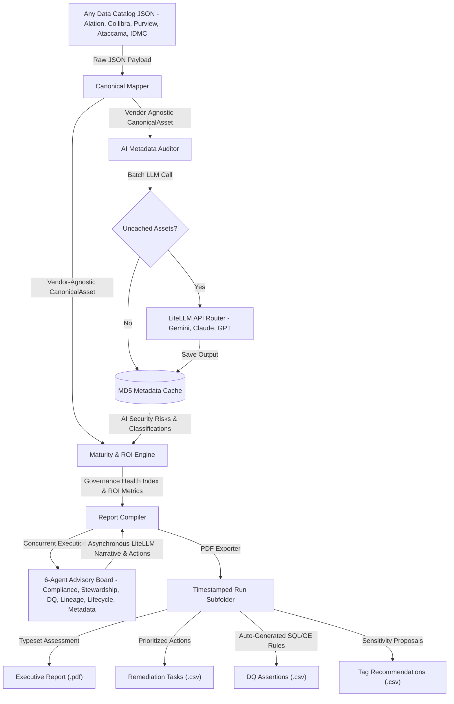

# AI-Powered Governance ROI Optimization Accelerator

## Executive Summary
Organizations spend millions of dollars deploying Enterprise Data Governance platforms like **Alation, Collibra, Informatica IDMC, Ataccama, and Microsoft Purview**. However, demonstrating concrete Business Return on Investment (ROI) and translating raw metadata into execution remain persistent challenges for the Chief Data Office (CDO).

The **AI-Powered Governance ROI Optimization Accelerator** is an advanced, vendor-agnostic framework designed to ingest, map, score, and monetize data governance assets. By using state-of-the-art **generative AI** in combination with conservative, industry-grounded financial models, this accelerator bridges the gap between technical metadata and executive-level business value.

### How AI Unlocks Governance Value
Rather than relying on manual audits, the accelerator embeds AI at the core of the evaluation flow:
1. **AI Metadata Auditor & Classifier**: Evaluates asset documentation quality, flags semantic sensitivity (PII, PHI, PCI, Confidential), and assesses compliance risks using structured LLM classification.
2. **Asynchronous Multi-Agent Advisory Board**: Spawns 6 specialized agent personas concurrently using LiteLLM to provide deep discipline assessments, executive reasoning, strengths, gaps, and remediation actions.
3. **Auto-Generated Data Quality (DQ) Assertions**: Translates columns to active SQL data quality rules and Great Expectations JSON blocks.
4. **Intelligent Tag & Security Policy Recommendations**: Suggests column-level security tags, confidence scores, and database masking actions.

---

## Architecture & Data Flow




1. **Ingest / Raw Data**: Ingests raw JSON payloads exported from any major catalog vendor.
2. **Canonical Mapping**: Automatically maps diverse vendor schemas into Pydantic models defined in [canonical_metadata_model.py](canonical_metadata_model.py).
3. **AI Metadata Auditing**: Evaluates documentation quality and classifies sensitivity (such as PII/PCI) using an LLM. Cached results are retrieved from `.governance_score_cache.json` if the metadata hash matches.
4. **Scoring & ROI Engines**: Calculates technical scores and converts them into real financial savings based on industry benchmarks.
5. **Multi-Agent Advisory Board**: Six specialist agents run concurrently to provide domain-expert assessments.
6. **Subfolder-based Publishing**: Compiles the final typeset PDF and outputs three distinct operational CSV registries to a dedicated platform-and-timestamp run folder under [reports/](reports/).

---

## The Core Role of AI in the Accelerator

AI is not just a passive addition; it drives the metadata enrichment, qualitative reasoning, and actionable output stages:

### 1. Batch AI Metadata Auditing
Implemented in [governance_scoring_engine.py](governance_scoring_engine.py), the `GovernanceScoringEngine` groups canonical assets into batches and utilizes an LLM to:
- Detect description placeholders (e.g., `"TBD"`, `"temp"`, `"test"`) and assess semantic richness.
- Identify sensitive fields (PII, PHI, PCI, or Confidential) from names, comments, and schemas.
- Calculate a `security_risk_score` (0-100) by evaluating whether sensitive data has proper ownership, active data quality validation, and classification tags.

### 2. Concurrent Multi-Agent Advisory Board
Implemented in [maturity_assessment_engine.py](maturity_assessment_engine.py), the `MaturityAssessmentEngine` spins up 6 specialized agent personas using `asyncio.gather`. Each agent represents a distinct CDO domain expert:

| Agent Persona | Focus Area | Prompt Analysis Objective |
| :--- | :--- | :--- |
| **Compliance Agent** | Data Security & Privacy | Evaluates exposure risk of sensitive columns and advises on classification, masking, and RBAC strategies. |
| **Stewardship Agent** | Stewardship & Governance | Reviews ownership assignment metrics and plans outreach campaigns to resolve stewardship gaps. |
| **Lineage Agent** | Data Architecture & Lineage | Investigates dependency mapping coverages and recommends automated lineage harvesting methods. |
| **DQ Agent** | Data Quality | Audits pass rates and coverage, recommending targeted profiling rules for critical data elements. |
| **Lifecycle Agent** | Data Lifecycle & Storage | Evaluates storage sizes and query logs to identify ROT candidates and deep archive policies. |
| **Metadata Agent** | Metadata Management | Measures description completeness and glossary linkage to improve catalog findability. |

Each agent writes a concise executive summary, highlights 1-3 active strengths, flags 1-3 critical gaps, and compiles 3 actionable remediation steps.

### 3. Automated Rule & Great Expectations Generation
The report compiler parses column metadata to generate specific validation assertions:
- **Primary Keys**: Generates `SQL` duplicate/null checks and corresponding `Great Expectations` JSON expectation blocks (`expect_column_values_to_be_unique`, `expect_column_values_to_not_be_null`).
- **Foreign Keys**: Generates referential integrity checks (`expect_column_values_to_be_in_set`).
- **Sensitive Formats (Email/Phone/SSN/Tax)**: Produces pattern validation SQL and Regex-based expectations.

---

## File Layout

- [canonical_metadata_model.py](canonical_metadata_model.py): Defines the unified Pydantic data structures (`CanonicalAsset`, `AssetOwner`, `DataQualitySummary`, etc.) and vendor-specific mappers.
- [governance_scoring_engine.py](governance_scoring_engine.py): Executes metadata completeness heuristics, LLM-based security risk profiling, and computes the composite Governance Health Index (GHI).
- [maturity_assessment_engine.py](maturity_assessment_engine.py): Manages the asynchronous Multi-Agent Advisory Board and configures domain personas.
- [roi_calculation_engine.py](roi_calculation_engine.py): Maps technical health indexes to dollar-value ROI and identifies Redundant, Obsolete, or Trivial (ROT) datasets.
- [executive_pdf_report.py](executive_pdf_report.py): Orchestrates the entire process—maps raw files, calculates scores, queries agents, compiles the PDF, and writes the 3 companion CSV registries.
- [maturity_config.json](maturity_config.json): Configuration file specifying weights, indicators, and threshold levels for the maturity model.
- [reports/](reports/): Output folder containing timestamped subdirectory runs for each platform execution.
- [RealisticGovernanceMetadata.py](RealisticGovernanceMetadata.py): Scaling tool and CLI performance demo runner for simulated metadata creation.
- [generate_all_mock_data.py](generate_all_mock_data.py): Generates mock data files for all catalog platforms.
- `.governance_score_cache.json`: Local MD5 metadata-hash cache to prevent redundant LLM API calls and optimize execution costs.
- `.rate_limit_cache.json`: Tracks historical requests and token usage to prevent API provider throttle limits.

---

## Mathematical Models & Research Grounding

### 1. Governance Maturity Scores
* **Metadata Management (Weight: 20%)**: Weighted average of Documentation Coverage (30%), Ownership Coverage (30%), Glossary Linkage (20%), and Classification Coverage (20%).
* **Data Quality (Weight: 20%)**: Blends DQ Rule Coverage (40%) and DQ Pass Rate (60%), applying a time-decay penalty for stale profiling runs (10% penalty for 8–30 days, 50% penalty for >30 days).
* **Data Security & Privacy (Weight: 15%)**: Measures sensitive classification and security alignment.
* **Stewardship & Governance (Weight: 15%)**: Assesses the presence of active stewards.
* **Data Architecture & Lineage (Weight: 15%)**: Lineage coverage mapping downstream and upstream connections.
* **Data Lifecycle (Weight: 15%)**: Measures active cataloging and tiering optimization.

$$\text{Overall Maturity Score} = \sum (\text{Discipline Score} \times \text{Weight})$$

*Assets are grouped into Criticality Tiers (Tier 1: Critical, Tier 2: Core, Tier 3: Local) based on active query logs and user counts to focus CDO attention.*

### 2. Financial ROI Calculations
The engine uses conservative, enterprise-grounded financial models:

* **Data Discovery Efficiency Savings**:
  $$\text{Discovery Savings} = (\text{Annual Queries} \times 0.05\% \text{ search ratio}) \times 3.5 \text{ hrs saved} \times \$75/\text{hr rate} \times \frac{\text{Doc Score}}{100}$$
* **ROT Storage Savings**:
  $$\text{Storage Savings} = \text{Asset Size (GB)} \times \text{Storage Rate (\$/GB/Year)}$$
  *Targets storage objects with zero queries and inactive status for >6 months.*
* **Data Quality Incident Avoidance**:
  $$\text{DQ Savings} = (\text{Baseline Prob [5\%]} - \text{Current Prob}) \times \$15,000 \text{ incident cost}$$
* **Lineage Root Cause Analysis (RCA) Savings**:
  $$\text{RCA Savings} = \text{Annual Incidents} \times 6.5 \text{ hrs saved} \times \$75/\text{hr rate} \times \text{Lineage Presence [0 or 1]}$$
* **Compliance Breach Risk Reduction**:
  $$\text{Risk Mitigation Savings} = (5\% \text{ baseline probability} - \text{Current probability}) \times \$150,000 \text{ breach cost}$$
* **Compute Optimization Savings**:
  $$\text{Compute Savings} = \text{Annual Compute Cost} \times 15\% \text{ waste reduction}$$

---

## Enterprise Safety & Performance Optimization

To protect operational budgets and prevent API failures, the framework features:
- **Metadata Caching**: Creates unique MD5 hashes of asset metadata. Unchanged assets skip LLM calls, reducing API expenses to $\$0$ on subsequent runs.
- **Dynamic Rate Limit Discovery**: Queries the LLM provider on start, extracts limit parameters from response headers, and limits client request rates to **60% of provider maximums** (RPM, TPM, RPD) to prevent API throttling.

---

## CI/CD Pipeline & Quality Assurance

To maintain high standards of code quality, security, and static type safety, the repository includes a complete validation suite integrated via GitHub Actions (defined in `.github/workflows/python-package.yml`).

### Running Quality Checks Locally

You can run the same pipeline checks locally using the following commands:

1. **Code Formatting & Linting (Ruff)**:
   ```bash
   ruff format --check .
   ruff check .
   ```
2. **Security Scan (Bandit)**:
   ```bash
   bandit -r . -x ./.venv,./tests --severity-level medium -s B608,B324
   ```
   *(Skips string SQL representation and cache hashing false positives)*
3. **Dependency Vulnerability Audit (pip-audit)**:
   ```bash
   pip-audit -r requirements.txt
   ```
4. **Static Type Safety Check (Mypy)**:
   ```bash
   mypy --ignore-missing-imports --explicit-package-bases .
   ```
5. **E2E Ingest & Generation Tests**:
   ```bash
   python generate_all_mock_data.py --num-assets 5
   python executive_pdf_report.py --platform alation --input alation/sample_alation_metadata.json
   ```

---

## Quick Start Guide

### Setup & Ingestion
1. Install dependencies:
   ```bash
   pip install -r requirements.txt
   ```
2. Set your API Key (e.g., for Gemini):
   ```bash
   set GEMINI_API_KEY="your-api-key"
   ```
   *(Alternatively, set `ANTHROPIC_API_KEY` or `OPENAI_API_KEY`. If no key is set, the accelerator falls back to local heuristic engines.)*

3. Generate scaled mock metadata for simulation:
   ```bash
   python RealisticGovernanceMetadata.py --num-assets 50
   ```

### Running Reports
To run the accelerator on a platform input (e.g., Alation):
```bash
python executive_pdf_report.py --platform alation --input alation/sample_alation_metadata.json
```

### Output Deliverables
The framework compiles its results under a dynamic run subfolder inside the `reports/` directory (e.g., `reports/alation_20260612_101500/`):
1. **Executive Report PDF** (`*executive_report.pdf`): Audit-ready assessment report detailing maturity scores, TCS scores, net ROI, and narrative sections generated by the AI Advisory Board.
2. **Remediation Task Registry CSV** (`*_remediation_registry.csv`): Actionable tasks organized by impact, assigning owners/stewards and documenting the financial opportunity of resolving each issue.
3. **Auto-Generated DQ Assertions CSV** (`*_dq_assertions_registry.csv`): Pre-written SQL assertions and Great Expectations JSON blocks for fast deployment of database profiling and testing constraints.
4. **Tag Recommendations Registry CSV** (`*_tag_recommendations_registry.csv`): Recommended sensitive classification tags based on column semantic analysis, including confidence ratings and security instructions.
